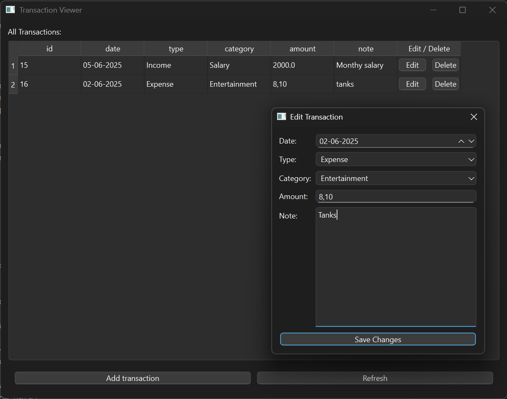

# Budgeteer
Budgeteer is a simple desktop budgeting application built with Python and PySide6. It allows you to track your income and expenses, categorize transactions, and edit or delete them as needed. All data is stored locally in an SQLite database.

## Features

- Add, edit, and delete transactions
- Categorize transactions (Food, Bills, Salary, Entertainment, Other)
- View all transactions in a sortable table
- Simple and clean GUI

## Requirements

- Python 3.7+
- PySide6

## Setup

1. **Install dependencies:**
   ```sh
   pip install PySide6
   ```

2. **Initialize the database:**
   *(Create a `setup_db.py` script if not present, to create the `transactions` table in `budget.db`.)*

3. **Run the application:**
   ```sh
   python budgeteer_gui.py
   ```

## File Overview

- `budgeteer_gui.py` — Main GUI application to view, add, edit, and delete transactions.
- `add_transaction.py` — Dialog for adding new transactions.
- `edit_transaction.py` — Dialog for editing existing transactions.
- `budget.db` — SQLite database file (created after running the app).

## Screenshots

